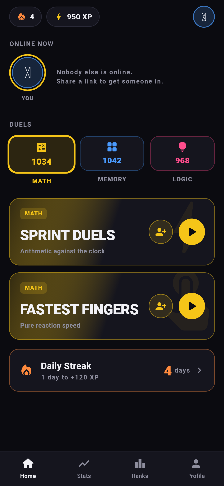
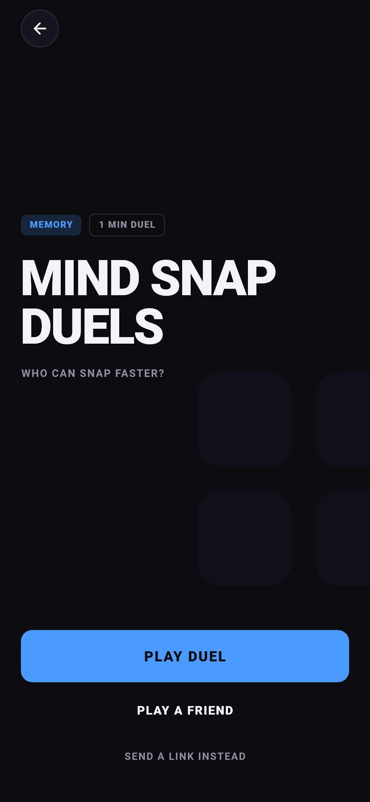
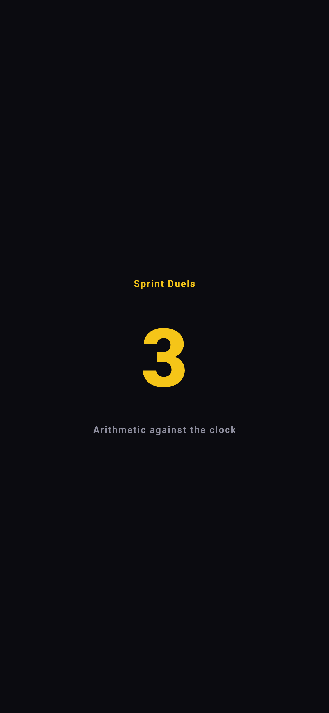
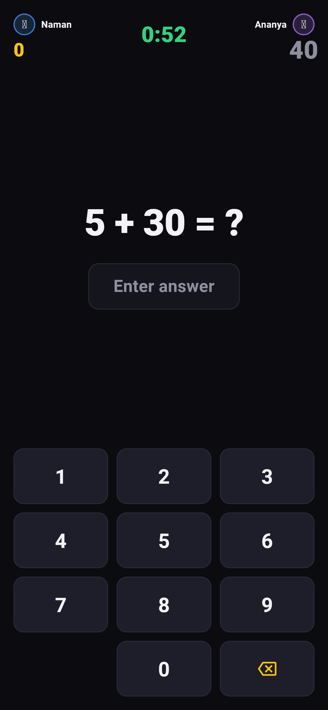
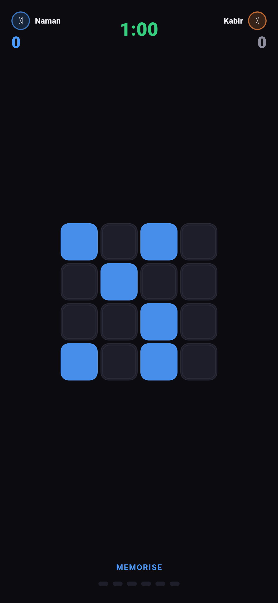
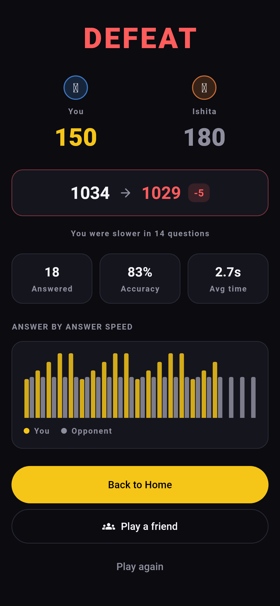
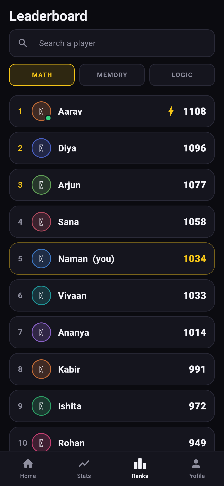
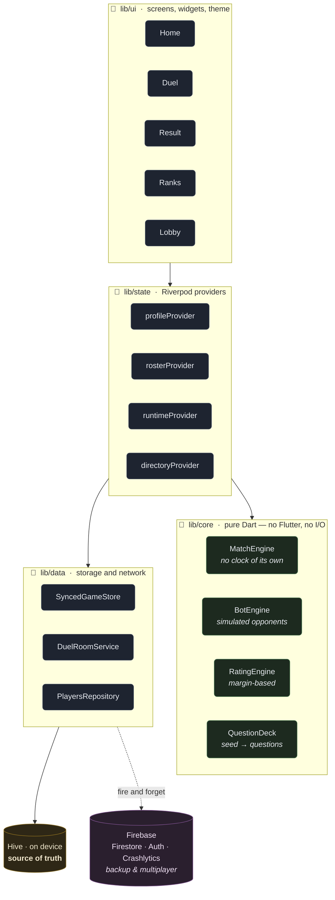
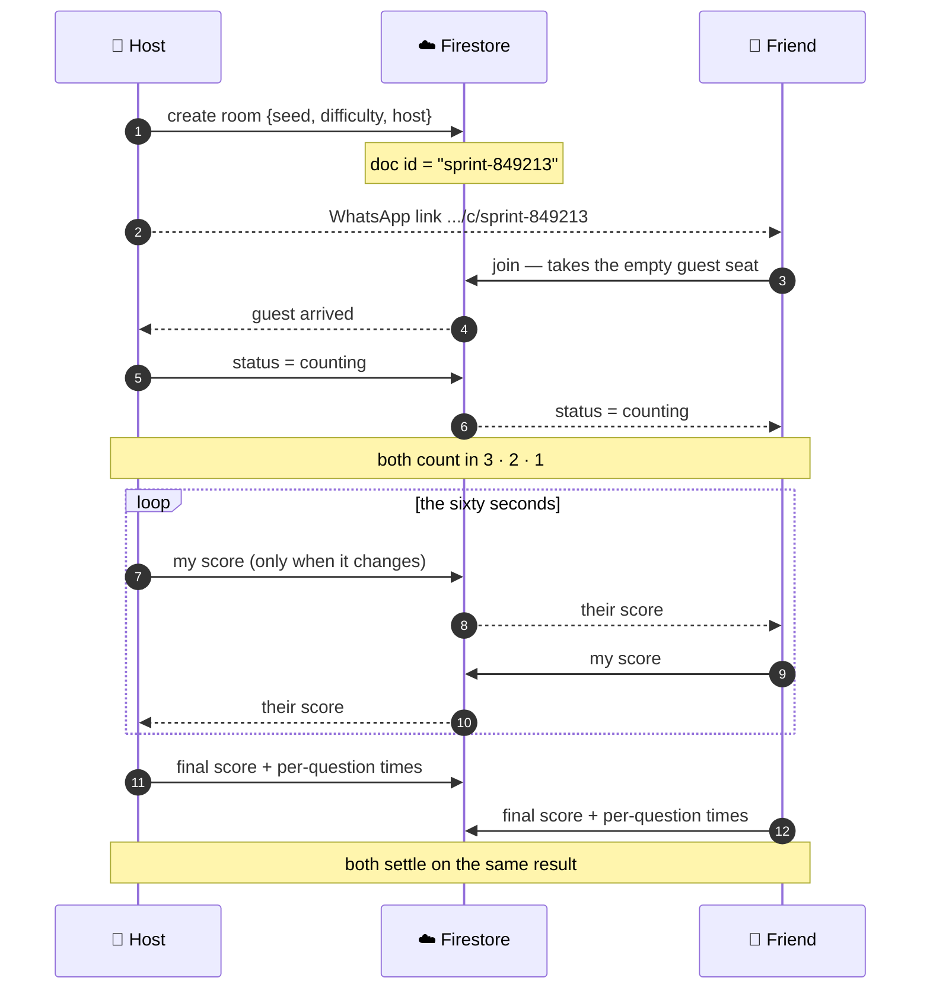

<div align="center">

# MindRush

**Two people. The same questions. Sixty seconds.**

A mobile quiz-duel game built in Flutter — four game modes, simulated opponents that play like people, and real-time multiplayer over a single Firestore document.

<br/>


<br/>


</div>

---

## What it is

Every match is exactly **sixty seconds**. You and your opponent answer the *identical* question set at the same time, and the higher score wins. Play instantly against a simulated opponent, or send a friend a WhatsApp link and watch each other's score tick up live.

| Mode | Discipline | What it tests |
|:--|:--|:--|
| **Sprint Duels** | Math | Mental arithmetic on a keypad |
| **Fastest Fingers** | Math | Pure reaction speed — ~70 questions a match |
| **Mind Snap** | Memory | Pattern recall on a flashing grid |
| **Ability Duels** | Logic | Sequences and odd-one-out |

**The whole game works with no internet.** Storage is local-first and the cloud is a backup, so the app opens instantly and never blocks on a network. Only the global leaderboard and friend duels need a connection.

---

## How you play

<table>
<tr>
<td width="50%" valign="top">

### 1 · Pick a discipline

Math, Memory or Logic. Each carries its own rating, and the tiles below filter to that discipline's duels.

Your streak and XP sit along the top; anyone online right now shows under **ONLINE NOW**.

</td>
<td width="50%"></td>
</tr>

<tr>
<td width="50%"></td>
<td width="50%" valign="top">

### 2 · Choose your opponent

Every mode has its own page: your rating in it, your recent form, and the two ways in.

**Play now** draws a simulated opponent near your rating. **Play a friend** opens a room and hands you a link.

</td>
</tr>

<tr>
<td width="50%" valign="top">

### 3 · Both phones count in

Three, two, one. In a friend duel both sides count in together — the host flips the room's status and Firestore pushes it to both devices on the same tick.

Backing out here still ends the match for both of you, cleanly.

</td>
<td width="50%"></td>
</tr>

<tr>
<td width="50%"></td>
<td width="50%" valign="top">

### 4 · Answer against the clock

The scoreboard carries both players and both scores, live. Answers auto-submit the moment your entry is as long as the answer — no confirm button, because a confirm tap on every question wrecks the pace.

Your opponent's number moves as they earn it.

</td>
</tr>

<tr>
<td width="50%" valign="top">

### 5 · Mind Snap works differently

The grid flashes a pattern, then hides it. Tap it back from memory. Partial recall still scores.

Grids grow as the minute goes on — 4×4, then 5×5, then 6×6 — so a run that starts comfortable ends genuinely hard.

</td>
<td width="50%"></td>
</tr>

<tr>
<td width="50%"></td>
<td width="50%" valign="top">

### 6 · See exactly how you lost

Final scores, the rating change, accuracy, and an **answer-by-answer speed chart** putting your time on each question against theirs.

From here you can rematch the same person or go looking for someone else.

</td>
</tr>

<tr>
<td width="50%" valign="top">

### 7 · Challenge anyone who's live

The leaderboard is every registered player, not just people you've duelled. A green dot means they're online right now.

Tap anywhere on their row to send a challenge — it arrives on their phone as an accept/decline prompt.

</td>
<td width="50%"></td>
</tr>
</table>

---

## Architecture

Four layers, and the rule is that lower layers never know about higher ones. `lib/core` holds the whole game as **pure Dart with zero Flutter imports**, so the rules of the game are completely separate from anything that draws them.



**Why the arrow to Firebase is dotted:** every cloud write is fire-and-forget. A finished match is on disk before the result screen draws, and the upload happens behind it. A slow network can never sit between a player and their score.

### Directory map

```
lib/
├── core/          pure Dart — the rules of the game, no Flutter import
│   ├── bots/          simulated opponents, tiers, opponent selection
│   ├── challenge/     friend-duel rooms, invite links, live opponent feed
│   ├── match/         MatchEngine, MatchResult, the OpponentFeed interface
│   ├── questions/     deterministic question generators, one per mode
│   ├── rating/        rating maths, daily streak, streak rewards
│   └── players/       the player directory and presence rule
├── data/          Hive, Firestore, Google sign-in, error reporting
├── state/         Riverpod providers — the seam between data and UI
├── notifications/ streak reminders, scheduled on device
├── router/        GoRouter routes, including the deep link
└── ui/            screens, widgets, theme
```

---

## How a friend duel works

Two phones never talk to each other. They talk to **one Firestore document**, and each writes only its own half of it.



**The link carries almost nothing** — the room code and the sender's name. Everything that decides the match lives in the document, so a forwarded or edited link can't contradict the real thing.

**Neither phone sends questions.** The room holds a random **seed**, and both devices generate the identical deck from it locally. Same seed, same questions, every time — one integer instead of a stream of question data.

---

## Design decisions worth knowing

**You are your Google account, not a name you typed.** Identity used to live on the device, which meant uninstalling the app orphaned your leaderboard row and made a second one next time — the same person, twice, with their rating split between them. A Google account is the same account on the next install and on the next phone, so the board stays honest. Only the first launch needs a network for it; the credential is cached, and a returning player opens the app offline with everything intact.

**The match engine has no clock.** The screen owns a `Ticker` and pushes elapsed milliseconds into the engine with `advanceTo(ms)`. Time is an input rather than something the engine reaches out and grabs, which keeps every rule of the match independent of how, or how fast, the clock actually runs.

**Bots are simulated, not scripted.** A bot's entire minute is generated up front as timestamped scoring events. Its *form* is rolled once per match rather than per question, so it has a good day or a bad day the way a person does — the giveaway of a fake opponent is consistency, not the name on the scoreboard.

**Rating is margin-based, not Elo.** Win by a lot, gain a lot; win narrowly, gain a little. Capped at ±11. The opponent's rating decides *who you face*, never *what you earn* — which makes the number readable to a player. Opponent selection (the three bots nearest your rating) is what keeps it converging.

**The engine can't tell a bot from a human.** Both implement one `OpponentFeed` interface, so multiplayer needed zero changes to match logic.

**Notifications need no server.** The phone knows your streak, so it reminds itself. The reminder always sits one day after your last match, rescheduled after every match — no push service, no background job, works in airplane mode.

**The intro is the intro, not a loading screen wearing one.** `main()` awaits nothing before `runApp`, because Android holds its own splash until Flutter draws its first frame — so every await there was time spent looking at a still picture of the logo instead of the animation of it. Opening the local save happens *behind* the intro, and Firebase waits until it is over rather than competing with it for frames on the coldest start the app ever has.

**Swallowed errors are still reported.** Roughly 27 places catch an error and carry on, which is correct behaviour but means the app can be quietly broken. Each one calls a reporting seam that forwards to Crashlytics as a non-fatal, with ordinary network noise filtered out.

---

## Running it

```bash
flutter pub get
flutter run --release                      # on a connected device
flutter analyze                            # lints
flutter build apk --release --split-per-abi   # → build/app/outputs/flutter-apk/
```

**Use a release build to judge how it feels.** A debug build is JIT-compiled and spends its first couple of seconds warming the engine up and compiling shaders — which is exactly the window the intro animation plays in, so it arrives as a stutter. Breakpoints need debug; motion needs release.

`--split-per-abi` builds one APK per architecture (~21 MB) instead of one carrying all three (~57 MB). Install `app-arm64-v8a-release.apk` on any phone from the last several years.

Firebase is optional in development — without it the app runs single-player on local storage, which is a deliberate fallback rather than a crash. To enable the cloud half, add your own `android/app/google-services.json` and regenerate `lib/firebase_options.dart`. Google sign-in additionally needs your signing certificate's SHA-1 registered on the Firebase project, and the **web** OAuth client id (not the Android one) as the `serverClientId`.

---

<div align="center">
<sub>Built with Flutter · 68 source files · 13,800 lines of Dart</sub>
</div>
